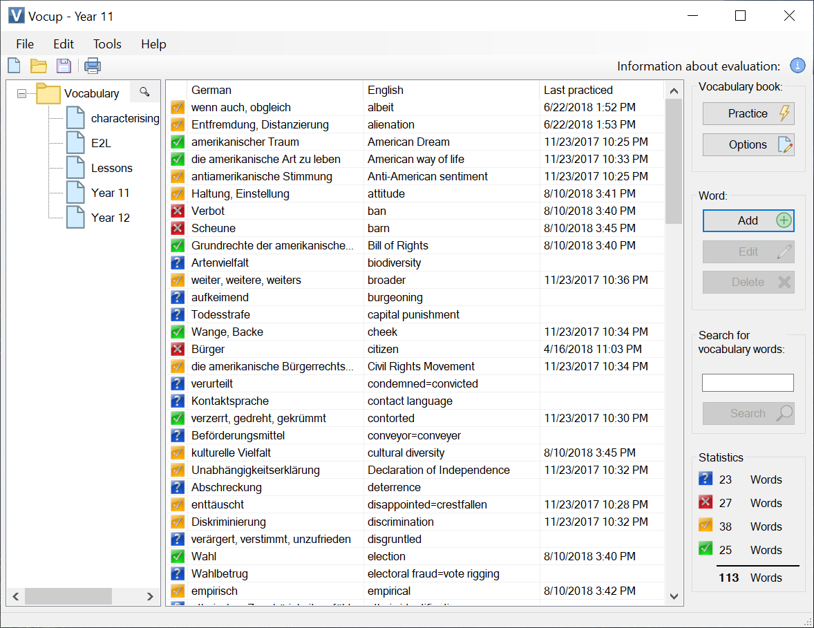

# Vocup

Vocup is a free and open source vocabulary trainer.

Keep your vocabulary books locally. No account. No cloud. No ads.

> I don't make money with Vocup. If you like it, please consider a [donation](https://github.com/sponsors/daniel-lerch).

## Windows

Install Vocup for Windows 10 and Windows 11 directly from the Microsoft Store. Easy. Secure. With automatic updates.

## Android

Install Vocup for Android directly from the Google Play Store. **Limited functionality**, only a .vhf file viewer so far.

## Unsupported platforms

### macOS

Vocup is going to support macOS in the future [#18](https://github.com/daniel-lerch/vocup/issues/18). 

### iOS

I am waiting for sponsors before working on iOS support because that requires a Mac and an Apple Developer account ($100/year).

### ~~Windows 7~~

Windows 7 is not supported anymore. Neither by Microsoft nor by Vocup. There are no plans to reintroduce support, however you can still download and use [Vocup 1.8.7](https://github.com/daniel-lerch/vocup/releases/tag/v1.8.7).

### ~~Linux~~

Linux is not supported anymore. However, you can still download Vocup 1.8.7 or build more recent versions on your own. See the [Linux installation guide](docs/install-on-linux.md) for more details.

## Contribute

I am more than happy to accept pull requests for Vocup. Please open an issue before to discuss your intended changes.
